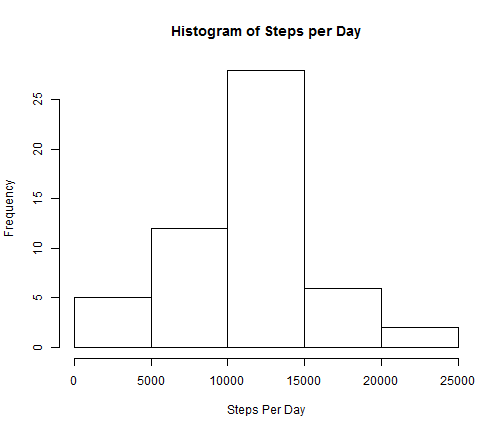
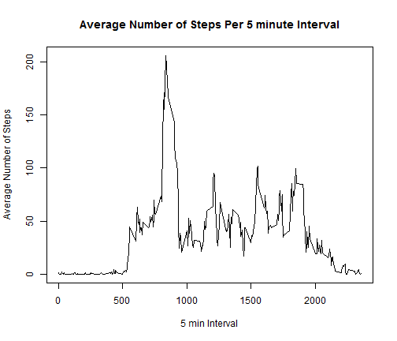
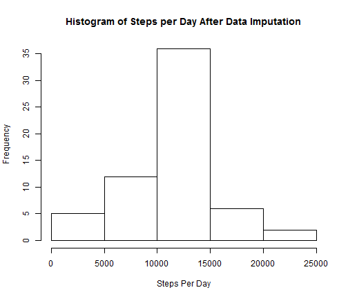
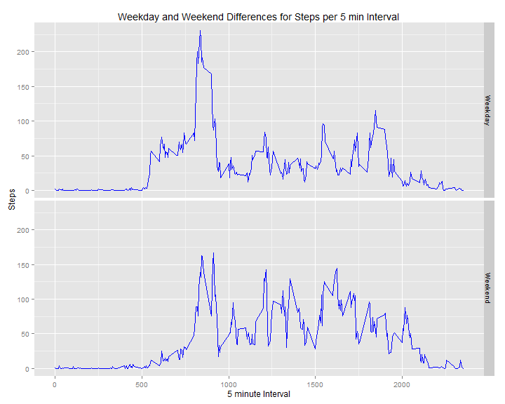

Title: Reproducible Research: Peer Assessment 1
========================================================

## Loading and preprocessing the data
1) Make sure to set the wd using setwd() function  
2) Download the zipped file manually to the directory  
3) R can unzip the file and read the CSV  
4) str() function shows the dimension of the data file  


```r
unzip("activity.zip")
activity <- read.csv("activity.csv", na.strings = "NA")
str(activity)
```

```
## 'data.frame':	17568 obs. of  3 variables:
##  $ steps   : int  NA NA NA NA NA NA NA NA NA NA ...
##  $ date    : Factor w/ 61 levels "2012-10-01","2012-10-02",..: 1 1 1 1 1 1 1 1 1 1 ...
##  $ interval: int  0 5 10 15 20 25 30 35 40 45 ...
```
## What is mean total number of steps taken per day?
1) Histogram of total number of steps per day

```r
steps_per_day <- tapply(activity$steps,activity$date,sum)
hist(steps_per_day,xlab="Steps Per Day",main="Histogram of Steps per Day")
```

 

2) Calculate and report the mean and median total number of steps taken per day  
Mean:

```r
mean(steps_per_day,na.rm=TRUE)
```

```
## [1] 10766.19
```
Median:

```r
median(steps_per_day,na.rm=TRUE)
```

```
## [1] 10765
```
## What is the average daily activity pattern?
1) Make a time series plot (i.e. type = "l") of the 5-minute interval (x-axis) and the average number of steps taken, averaged across all days (y-axis)

```r
meanperinterval <- aggregate(steps ~ interval,activity,mean)
plot(meanperinterval$steps ~ meanperinterval$interval,type="l",xlab="5 min Interval",ylab="Average Number of Steps",main="Average Number of Steps Per 5 minute Interval")
```

 

2) Which 5-minute interval, on average across all the days in the dataset, contains the maximum number of steps?  
5 Minute Interval with maximum number of steps:

```r
meanperinterval$interval[which.max(meanperinterval$steps)]
```

```
## [1] 835
```
## Imputing missing values
1) Calculate and report the total number of missing values in the dataset (i.e. the total number of rows with NAs)  
Total Number of missing Values:

```r
sum(is.na(activity$steps))
```

```
## [1] 2304
```
2) Devise a strategy for filling in all of the missing values in the dataset. The strategy does not need to be sophisticated. For example, you could use the mean/median for that day, or the mean for that 5-minute interval, etc.    
Missing Values are imputed by interval averages:

```r
activity_imputed <- activity[is.na(activity$steps)=="TRUE",]
activity_imp1 <- merge(activity_imputed,meanperinterval,by="interval")
activity_imputed<-activity_imp1[,c(1,3,4)]
```

3) Create a new dataset that is equal to the original dataset but with the missing data filled in.  

```r
new_activity <- merge(activity,activity_imputed,by=c("date","interval"),all.x=TRUE)
new_activity$new_steps <- ifelse(is.na(new_activity$steps),round(new_activity$steps.y,0),round(new_activity$steps,0))
new_activity <- new_activity[,c(1,2,5)]
```

4) Make a histogram of the total number of steps taken each day and Calculate and report the mean and median total number of steps taken per day. Do these values differ from the estimates from the first part of the assignment? What is the impact of imputing missing data on the estimates of the total daily number of steps?

```r
steps_per_day <- tapply(new_activity$new_steps,new_activity$date,sum)
hist(steps_per_day,xlab="Steps Per Day",main="Histogram of Steps per Day After Data Imputation")
```

 

Mean:

```r
mean(steps_per_day)
```

```
## [1] 10765.64
```

Median:

```r
median(steps_per_day)
```

```
## [1] 10762
```

After the imputation of missing values, we can see that the histogram is looking more gaussian and the mean and median values are similar.

## Are there differences in activity patterns between weekdays and weekends?

```r
new_activity$wk_day <- weekdays(as.Date(new_activity$date, "%Y-%m-%d"))
new_activity$wknd_wkday <- ifelse(new_activity$wk_day %in% c("Saturday","Sunday"),"Weekend","Weekday")
meanperinterval <- aggregate(new_steps ~ interval+wknd_wkday,new_activity,mean)
library(ggplot2)
```

```
## Warning: package 'ggplot2' was built under R version 3.0.3
```

```r
ggplot(meanperinterval,aes(interval,new_steps))+geom_line(col="blue")+ facet_grid(wknd_wkday ~ .)+labs(x="5 minute Interval",y="Steps",title= "Weekday and Weekend Differences for Steps per 5 min Interval")
```

 

There are certainly differences between weekdays and weekends from the graph.
